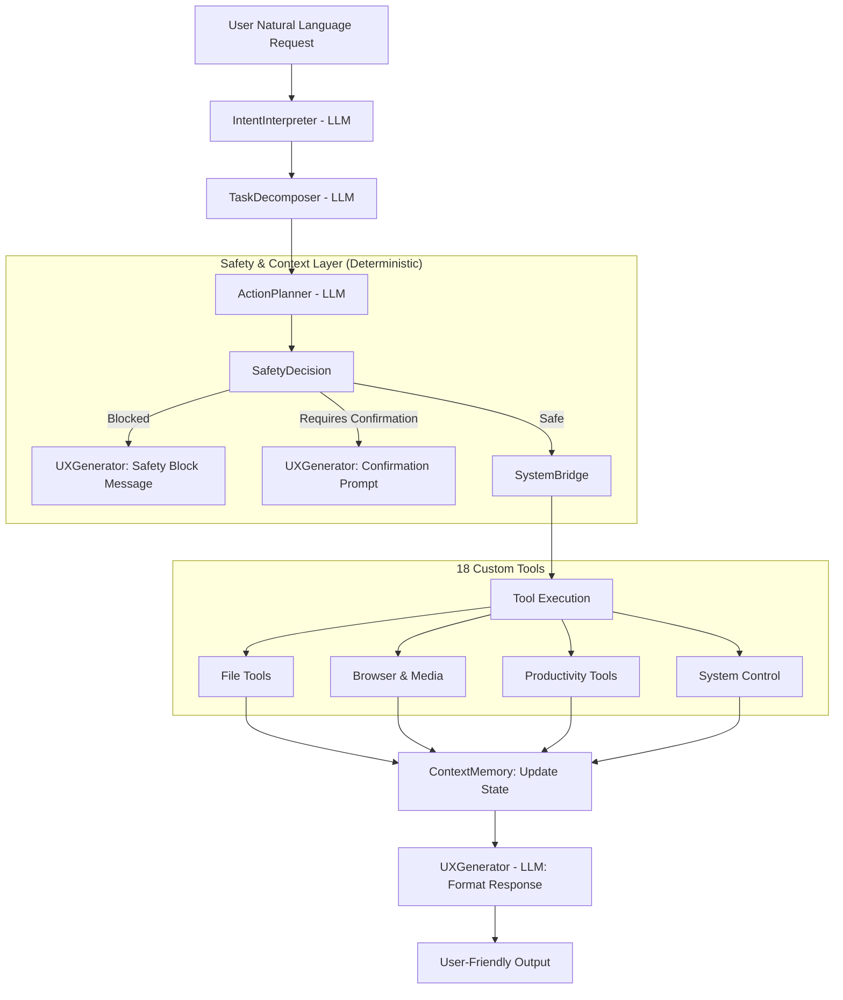

# Shinobu Agent 🦋
## The Insect Hashira - User Personal OS Assistant

Shinobu is the **human-facing heart** of Hashira-OS. While Giyu monitors system health and Rengoku executes system tasks, Shinobu acts as the bridge between *you* and the entire OS — understanding your intent in natural language, planning the required actions, and delivering results in a clear, friendly, and actionable format.

> *"She is Copilot + Alexa + File Manager + Browser Controller + Productivity Assistant — all in one."*

---

### 🎯 Role within Hashira-OS
Shinobu sits directly between the user and the system:

```
You (Natural Language)
        ↓
   Shinobu 🦋
        ↓
System Capabilities (Files, Browser, Tasks, Automation)
```

Her core responsibilities:
1. **Intent Understanding**: Parsing natural language to extract goals, entities, and multi-step requests.
2. **Workflow Orchestration**: Decomposing requests into ordered subtasks mapped to the right tools.
3. **Safety Guardian**: Blocking dangerous operations and requiring confirmation for destructive actions.
4. **Context Continuity**: Remembering open files, ongoing tasks, and session state across interactions.
5. **Friendly Delivery**: Formatting all agent outputs into human-readable, step-by-step responses.

---

### 🏗️ Architecture & Workflow



---

### 🔍 3-Level Intelligent Search System
Shinobu features a tiered research engine that adapts to the complexity of your request:

1.  **⚡ Fast Search**: Instant redirection. Best for "Open YouTube" or "Go to Twitter".
2.  **🎯 Mid Search**: Result aggregation. Scrapes search engines to provide a structured overview of links and snippets.
3.  **🧠 Deep Search**: Comprehensive analysis. Scrapes multiple high-authority sources, extracts full-text content, and uses LLM synthesis to provide a detailed research report.
4.  **🤖 Auto Mode**: The default setting where Shinobu's `IntentInterpreter` decides the optimal depth based on your natural language prompt.

---

---

### 🧠 The Hybrid Cognitive Architecture (7 Brains)

#### LLM-Powered Brains
- **`IntentInterpreter`**: Classifies the user's goal, detects multi-task requests, and extracts entities (file names, apps, topics).
- **`TaskDecomposer`**: Breaks a request like *"open file and write a summary"* into ordered atomic subtasks.
- **`ActionPlanner`**: Maps each subtask to the optimal tool and sets the execution order.
- **`UXGenerator`**: Formats all agent output in Shinobu's friendly, step-by-step voice.

#### Deterministic Brains (No LLM — Reliable)
- **`SystemBridge`**: The translation layer that converts high-level AI actions into concrete OS operation descriptors.
- **`ContextMemory`**: In-memory session tracker for open files, ongoing tasks, and interaction logs — also persisted to `shinobu.context.json`.
- **`SafetyDecision`**: A strict rules engine that validates every action before execution, blocking protected paths and flagging destructive tools for user confirmation.

---

### 🛠️ Custom User-Operations Toolset (18 Tools)

#### 📁 File System (5)
| Tool | Description |
|---|---|
| `file_reader` | Reads files of any text type |
| `file_writer` | Creates or overwrites files |
| `file_editor` | Patch-based file editing |
| `file_deleter` | Deletes files after explicit confirmation |
| `file_search_engine` | Glob-pattern search across directories |

#### 🌐 Browser & Internet (4)
| Tool | Description |
|---|---|
| `web_search_tool` | General search query execution |
| `deep_search_tool` | Multi-source research aggregation |
| `browser_controller` | Opens URLs in the system browser |
| `media_preparer` | Finds and streams media via browser |

#### 📊 Productivity (4)
| Tool | Description |
|---|---|
| `task_manager` | Creates and tracks local user tasks |
| `reminder_system` | Schedules time-based reminders |
| `spreadsheet_manager` | Creates and reads CSV sheets |
| `document_generator` | Generates structured Markdown reports |

#### 💬 Communication (2)
| Tool | Description |
|---|---|
| `chat_context_manager` | Manages conversation log history |
| `response_formatter` | Formats output as bullets or numbered lists |

#### ⚙️ System Control (3)
| Tool | Description |
|---|---|
| `process_launcher` | Launches OS applications |
| `system_command_bridge` | Executes safe, whitelisted OS commands |
| `automation_pipeline_builder` | Creates multi-step workflow pipelines |

---

### 🧠 Adaptive Context (`shinobu.context.json`)
Shinobu's backbone stores all operational state, making her aware across sessions:
- **`intent_logs`**: Every interpreted user intent from the `IntentInterpreter` brain.
- **`safety_events`**: All actions blocked or flagged by the `SafetyDecision` brain.
- **`session_context`**: Live snapshots from `ContextMemory` (open files, tasks).
- **`automation_pipelines`**: Records of all pipelines built by the user.

---

### 📖 How to Run

```bash
# Activate the virtual environment
source phx_venv/bin/activate

# Run the full Shinobu test suite
python Shinobu/tests/test_shinobu_full.py
```
